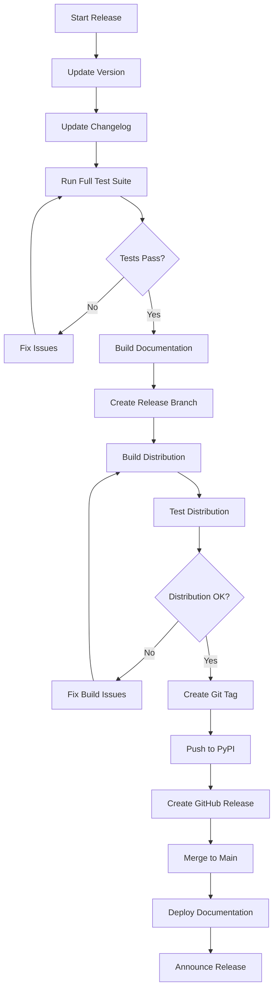

# Release Process

This guide covers the complete release process for Python Patch, including version management, testing, documentation updates, and distribution.

## Release Workflow Overview



## Pre-Release Checklist

### 1. Code Quality Verification

```bash
# Run complete test suite
python -m pytest tests_pytest/ -v --cov=src/patch --cov-fail-under=90

# Run legacy tests
python tests/run_tests.py

# Code quality checks
black --check src/ tests_pytest/
isort --check-only src/ tests_pytest/
flake8 src/ tests_pytest/
mypy src/

# Security scan
bandit -r src/

# Documentation build
mkdocs build --strict
```

### 2. Version Management

#### Update Version Numbers

```python
# src/patch/constants.py
__version__ = "1.2.3"  # Update version here
```

```toml
# pyproject.toml
[project]
version = "1.2.3"  # Update version here
```

#### Version Validation Script

```python
# scripts/validate_version.py
import re
import sys
from pathlib import Path

def validate_version_consistency():
    """Ensure version is consistent across all files."""
    
    # Read version from constants.py
    constants_file = Path('src/patch/constants.py')
    constants_content = constants_file.read_text()
    
    version_match = re.search(r'__version__ = ["\']([^"\']+)["\']', constants_content)
    if not version_match:
        print("ERROR: Could not find version in constants.py")
        return False
    
    version = version_match.group(1)
    print(f"Found version: {version}")
    
    # Check pyproject.toml
    pyproject_file = Path('pyproject.toml')
    pyproject_content = pyproject_file.read_text()
    
    if f'version = "{version}"' not in pyproject_content:
        print("ERROR: Version mismatch in pyproject.toml")
        return False
    
    # Check documentation
    mkdocs_file = Path('mkdocs.yml')
    if mkdocs_file.exists():
        # Version might be referenced in docs
        pass
    
    print("✓ Version consistency validated")
    return True

if __name__ == '__main__':
    if not validate_version_consistency():
        sys.exit(1)
```

### 3. Changelog Update

Update `CHANGELOG.md` with new version information:

```markdown
# Changelog

All notable changes to this project will be documented in this file.

## [1.2.3] - 2024-01-15

### Added
- New feature for handling binary patches
- Enhanced error reporting with detailed context
- Support for custom patch formats

### Changed
- Improved performance for large patch files
- Updated CLI help text for clarity
- Refactored parser for better maintainability

### Fixed
- Fixed issue with Windows path handling
- Resolved memory leak in large file processing
- Corrected edge case in hunk boundary detection

### Security
- Added validation for patch file paths
- Improved handling of malicious patch content

## [1.2.2] - 2024-01-01
...
```

## Release Automation

### Release Script

```bash
#!/bin/bash
# scripts/release.sh

set -e

VERSION=$1
if [ -z "$VERSION" ]; then
    echo "Usage: $0 <version>"
    echo "Example: $0 1.2.3"
    exit 1
fi

echo "Starting release process for version $VERSION"

# Validate version format
if ! [[ $VERSION =~ ^[0-9]+\.[0-9]+\.[0-9]+$ ]]; then
    echo "ERROR: Invalid version format. Use semantic versioning (e.g., 1.2.3)"
    exit 1
fi

# Check if we're on main branch
CURRENT_BRANCH=$(git branch --show-current)
if [ "$CURRENT_BRANCH" != "main" ]; then
    echo "ERROR: Must be on main branch for release"
    exit 1
fi

# Check for uncommitted changes
if ! git diff-index --quiet HEAD --; then
    echo "ERROR: Uncommitted changes detected"
    exit 1
fi

# Update version in files
echo "Updating version numbers..."
sed -i "s/__version__ = \".*\"/__version__ = \"$VERSION\"/" src/patch/constants.py
sed -i "s/version = \".*\"/version = \"$VERSION\"/" pyproject.toml

# Validate version consistency
python scripts/validate_version.py

# Run full test suite
echo "Running test suite..."
python -m pytest tests_pytest/ --cov=src/patch --cov-fail-under=90
python tests/run_tests.py

# Build documentation
echo "Building documentation..."
mkdocs build --strict

# Create release branch
RELEASE_BRANCH="release/$VERSION"
git checkout -b "$RELEASE_BRANCH"

# Commit version changes
git add src/patch/constants.py pyproject.toml
git commit -m "Bump version to $VERSION"

# Build distribution
echo "Building distribution..."
python -m build

# Test distribution
echo "Testing distribution..."
python -m twine check dist/*

# Create tag
git tag -a "v$VERSION" -m "Release version $VERSION"

echo "Release preparation complete!"
echo "Next steps:"
echo "1. Review changes: git log --oneline main..$RELEASE_BRANCH"
echo "2. Push release branch: git push origin $RELEASE_BRANCH"
echo "3. Create pull request for final review"
echo "4. After merge, run: scripts/publish.sh $VERSION"
```

### Publication Script

```bash
#!/bin/bash
# scripts/publish.sh

set -e

VERSION=$1
if [ -z "$VERSION" ]; then
    echo "Usage: $0 <version>"
    exit 1
fi

echo "Publishing release $VERSION"

# Ensure we're on main branch with latest changes
git checkout main
git pull origin main

# Verify tag exists
if ! git tag -l | grep -q "^v$VERSION$"; then
    echo "ERROR: Tag v$VERSION not found"
    exit 1
fi

# Build fresh distribution
rm -rf dist/
python -m build

# Upload to PyPI
echo "Uploading to PyPI..."
python -m twine upload dist/*

# Push tags
git push origin "v$VERSION"

# Deploy documentation
echo "Deploying documentation..."
mkdocs gh-deploy --force

# Create GitHub release
echo "Creating GitHub release..."
gh release create "v$VERSION" \
    --title "Release $VERSION" \
    --notes-file CHANGELOG.md \
    --latest \
    dist/*

echo "Release $VERSION published successfully!"
```

## Testing Releases

### Pre-Release Testing

```bash
# Test in clean environment
python -m venv test_env
source test_env/bin/activate

# Install from test PyPI
pip install --index-url https://test.pypi.org/simple/ python-patch

# Run basic functionality test
python -c "
import patch
print('Testing basic functionality...')

# Test parsing
patchset = patch.fromstring(b'''--- a/test.txt
+++ b/test.txt
@@ -1,1 +1,1 @@
-old
+new
''')

if patchset:
    print('✓ Parsing works')
    print(f'✓ Found {len(patchset)} patches')
else:
    print('✗ Parsing failed')
    exit(1)

print('✓ All basic tests passed')
"
```

### Release Candidate Testing

```bash
# Create release candidate
VERSION_RC="1.2.3rc1"

# Build and upload to test PyPI
python -m build
python -m twine upload --repository testpypi dist/*

# Test installation from test PyPI
pip install --index-url https://test.pypi.org/simple/ python-patch==$VERSION_RC

# Run comprehensive tests
python -m pytest tests_pytest/ -v
```

## Post-Release Tasks

### 1. Documentation Deployment

```bash
# Deploy documentation to GitHub Pages
mkdocs gh-deploy --force

# Verify documentation is accessible
curl -I https://astroair.github.io/python-patch/
```

### 2. Announcement

#### GitHub Release Notes Template

```markdown
# Release 1.2.3

## 🎉 What's New

- **Enhanced Performance**: 50% faster parsing for large patch files
- **Better Error Handling**: More descriptive error messages and recovery options
- **New CLI Options**: Added `--backup` and `--force` flags

## 🐛 Bug Fixes

- Fixed Windows path handling issues (#123)
- Resolved memory leak in stream processing (#124)
- Corrected edge case in binary patch detection (#125)

## 📚 Documentation

- Added comprehensive examples for CI/CD integration
- Improved API reference with more code samples
- New troubleshooting guide for common issues

## 🔧 Development

- Updated development dependencies
- Added pre-commit hooks for code quality
- Improved test coverage to 95%

## 📦 Installation

```bash
pip install --upgrade python-patch
```

## 🙏 Contributors

Thanks to all contributors who made this release possible!

**Full Changelog**: https://github.com/AstroAir/python-patch/compare/v1.2.2...v1.2.3
```

#### Social Media Announcement

```text
🚀 Python Patch v1.2.3 is now available!

✨ New features:
- 50% faster parsing
- Enhanced error handling
- New CLI options

🐛 Bug fixes:
- Windows path issues
- Memory leak fixes
- Binary patch detection

📦 Install: pip install --upgrade python-patch
📖 Docs: https://astroair.github.io/python-patch/

#Python #OpenSource #DevTools
```

### 3. Version Bump for Development

```bash
# After release, bump to next development version
NEXT_VERSION="1.2.4dev"

# Update version files
sed -i "s/__version__ = \".*\"/__version__ = \"$NEXT_VERSION\"/" src/patch/constants.py
sed -i "s/version = \".*\"/version = \"$NEXT_VERSION\"/" pyproject.toml

# Commit development version
git add src/patch/constants.py pyproject.toml
git commit -m "Bump version to $NEXT_VERSION for development"
git push origin main
```

## Release Validation

### Post-Release Verification

```python
# scripts/verify_release.py
import subprocess
import sys
import time

def verify_release(version):
    """Verify release is available and functional."""
    
    print(f"Verifying release {version}")
    
    # Check PyPI availability
    print("1. Checking PyPI availability...")
    result = subprocess.run([
        'pip', 'index', 'versions', 'python-patch'
    ], capture_output=True, text=True)
    
    if version not in result.stdout:
        print(f"ERROR: Version {version} not found on PyPI")
        return False
    
    print(f"✓ Version {version} available on PyPI")
    
    # Test installation
    print("2. Testing installation...")
    with tempfile.TemporaryDirectory() as temp_dir:
        venv_dir = os.path.join(temp_dir, 'test_venv')
        
        # Create test environment
        subprocess.run(['python', '-m', 'venv', venv_dir])
        
        # Install package
        pip_path = os.path.join(venv_dir, 'bin', 'pip')
        if os.name == 'nt':
            pip_path = os.path.join(venv_dir, 'Scripts', 'pip.exe')
        
        result = subprocess.run([
            pip_path, 'install', f'python-patch=={version}'
        ], capture_output=True)
        
        if result.returncode != 0:
            print(f"ERROR: Failed to install version {version}")
            return False
        
        print(f"✓ Successfully installed version {version}")
    
    # Check documentation
    print("3. Checking documentation...")
    import requests
    
    doc_url = f"https://astroair.github.io/python-patch/"
    try:
        response = requests.get(doc_url, timeout=10)
        if response.status_code == 200:
            print(f"✓ Documentation accessible at {doc_url}")
        else:
            print(f"WARNING: Documentation returned status {response.status_code}")
    except Exception as e:
        print(f"WARNING: Could not verify documentation: {e}")
    
    print(f"✓ Release {version} verification complete")
    return True

if __name__ == '__main__':
    if len(sys.argv) != 2:
        print("Usage: python verify_release.py <version>")
        sys.exit(1)
    
    version = sys.argv[1]
    success = verify_release(version)
    sys.exit(0 if success else 1)
```

## Hotfix Process

### Emergency Hotfix Workflow

```bash
#!/bin/bash
# scripts/hotfix.sh

set -e

HOTFIX_VERSION=$1
if [ -z "$HOTFIX_VERSION" ]; then
    echo "Usage: $0 <hotfix_version>"
    echo "Example: $0 1.2.4"
    exit 1
fi

echo "Creating hotfix release $HOTFIX_VERSION"

# Create hotfix branch from latest release tag
LATEST_TAG=$(git describe --tags --abbrev=0)
git checkout -b "hotfix/$HOTFIX_VERSION" "$LATEST_TAG"

echo "Hotfix branch created from $LATEST_TAG"
echo "Apply your fixes and run: scripts/publish_hotfix.sh $HOTFIX_VERSION"
```

```bash
#!/bin/bash
# scripts/publish_hotfix.sh

set -e

VERSION=$1
if [ -z "$VERSION" ]; then
    echo "Usage: $0 <version>"
    exit 1
fi

echo "Publishing hotfix $VERSION"

# Update version
sed -i "s/__version__ = \".*\"/__version__ = \"$VERSION\"/" src/patch/constants.py
sed -i "s/version = \".*\"/version = \"$VERSION\"/" pyproject.toml

# Run critical tests only
python -m pytest tests_pytest/test_core.py tests_pytest/test_api.py -v

# Commit and tag
git add src/patch/constants.py pyproject.toml
git commit -m "Hotfix version $VERSION"
git tag -a "v$VERSION" -m "Hotfix release $VERSION"

# Build and publish
python -m build
python -m twine upload dist/*

# Push changes
git push origin "hotfix/$VERSION"
git push origin "v$VERSION"

# Create GitHub release
gh release create "v$VERSION" \
    --title "Hotfix $VERSION" \
    --notes "Critical hotfix release" \
    dist/*

echo "Hotfix $VERSION published successfully"
```

## Release Types

### Major Release (X.0.0)

- **Breaking changes** to API
- **New major features**
- **Architecture changes**

```bash
# Major release checklist
- [ ] Update migration guide
- [ ] Test backward compatibility
- [ ] Update documentation extensively
- [ ] Coordinate with major users
- [ ] Extended testing period
```

### Minor Release (X.Y.0)

- **New features** (backward compatible)
- **Enhancements** to existing functionality
- **Deprecation warnings**

```bash
# Minor release checklist
- [ ] Feature documentation complete
- [ ] Deprecation warnings added
- [ ] Performance regression tests
- [ ] Integration tests updated
```

### Patch Release (X.Y.Z)

- **Bug fixes** only
- **Security fixes**
- **Documentation corrections**

```bash
# Patch release checklist
- [ ] Regression tests for fixed bugs
- [ ] Security impact assessment
- [ ] Minimal changes only
- [ ] Fast-track testing
```

## Quality Gates

### Automated Quality Checks

```python
# scripts/quality_gate.py
import subprocess
import sys

def run_quality_gate():
    """Run all quality checks required for release."""
    
    checks = [
        # Test coverage
        (['python', '-m', 'pytest', 'tests_pytest/', '--cov=src/patch', '--cov-fail-under=90'], 
         "Test coverage >= 90%"),
        
        # Code formatting
        (['black', '--check', 'src/', 'tests_pytest/'], 
         "Code formatting (Black)"),
        
        # Import sorting
        (['isort', '--check-only', 'src/', 'tests_pytest/'], 
         "Import sorting (isort)"),
        
        # Code style
        (['flake8', 'src/', 'tests_pytest/'], 
         "Code style (flake8)"),
        
        # Type checking
        (['mypy', 'src/'], 
         "Type checking (mypy)"),
        
        # Security scan
        (['bandit', '-r', 'src/'], 
         "Security scan (bandit)"),
        
        # Documentation build
        (['mkdocs', 'build', '--strict'], 
         "Documentation build"),
    ]
    
    failed_checks = []
    
    for command, description in checks:
        print(f"Running: {description}")
        
        result = subprocess.run(command, capture_output=True, text=True)
        
        if result.returncode == 0:
            print(f"  ✓ PASS")
        else:
            print(f"  ✗ FAIL")
            print(f"    Error: {result.stderr}")
            failed_checks.append(description)
    
    if failed_checks:
        print(f"\n❌ Quality gate FAILED")
        print(f"Failed checks:")
        for check in failed_checks:
            print(f"  - {check}")
        return False
    else:
        print(f"\n✅ Quality gate PASSED")
        return True

if __name__ == '__main__':
    success = run_quality_gate()
    sys.exit(0 if success else 1)
```

### Manual Review Checklist

```markdown
## Release Review Checklist

### Code Review
- [ ] All changes reviewed by at least one other developer
- [ ] No TODO comments in production code
- [ ] Error handling is comprehensive
- [ ] Performance impact assessed

### Documentation Review
- [ ] All new features documented
- [ ] API changes reflected in documentation
- [ ] Examples are working and tested
- [ ] Changelog is complete and accurate

### Testing Review
- [ ] New tests added for new features
- [ ] Edge cases covered
- [ ] Performance tests updated
- [ ] Integration tests passing

### Security Review
- [ ] No hardcoded secrets or credentials
- [ ] Input validation is comprehensive
- [ ] Path traversal protection in place
- [ ] Dependencies scanned for vulnerabilities
```

## Distribution Management

### PyPI Configuration

```toml
# pyproject.toml
[build-system]
requires = ["setuptools>=61.0", "wheel"]
build-backend = "setuptools.build_meta"

[project]
name = "python-patch"
version = "1.2.3"
description = "A modern, robust Python library for parsing and applying unified diffs"
readme = "README.md"
license = {text = "MIT"}
authors = [
    {name = "Max Qian", email = "astro_air@126.com"}
]
classifiers = [
    "Development Status :: 5 - Production/Stable",
    "Intended Audience :: Developers",
    "License :: OSI Approved :: MIT License",
    "Programming Language :: Python :: 3",
    "Programming Language :: Python :: 3.7",
    "Programming Language :: Python :: 3.8", 
    "Programming Language :: Python :: 3.9",
    "Programming Language :: Python :: 3.10",
    "Programming Language :: Python :: 3.11",
    "Topic :: Software Development :: Libraries :: Python Modules",
    "Topic :: System :: Archiving :: Packaging",
    "Topic :: Text Processing"
]
keywords = ["patch", "diff", "unified", "git", "svn", "mercurial"]
requires-python = ">=3.7"

[project.urls]
Homepage = "https://github.com/AstroAir/python-patch"
Documentation = "https://astroair.github.io/python-patch/"
Repository = "https://github.com/AstroAir/python-patch"
Issues = "https://github.com/AstroAir/python-patch/issues"
Changelog = "https://github.com/AstroAir/python-patch/blob/main/CHANGELOG.md"

[project.scripts]
patch = "patch.cli:main"
```

### Build Configuration

```bash
# Build wheel and source distribution
python -m build

# Check distribution
python -m twine check dist/*

# Upload to test PyPI first
python -m twine upload --repository testpypi dist/*

# After verification, upload to production PyPI
python -m twine upload dist/*
```

## Rollback Procedures

### Emergency Rollback

```bash
#!/bin/bash
# scripts/emergency_rollback.sh

VERSION_TO_REMOVE=$1
PREVIOUS_VERSION=$2

if [ -z "$VERSION_TO_REMOVE" ] || [ -z "$PREVIOUS_VERSION" ]; then
    echo "Usage: $0 <version_to_remove> <previous_version>"
    exit 1
fi

echo "EMERGENCY ROLLBACK: Removing $VERSION_TO_REMOVE, promoting $PREVIOUS_VERSION"

# Remove problematic release from PyPI (if possible)
echo "WARNING: Cannot remove from PyPI automatically"
echo "Contact PyPI administrators if necessary"

# Revert documentation
git checkout "v$PREVIOUS_VERSION"
mkdocs gh-deploy --force

# Update GitHub release to mark as problematic
gh release edit "v$VERSION_TO_REMOVE" \
    --title "⚠️ DEPRECATED - Release $VERSION_TO_REMOVE" \
    --notes "This release has been deprecated due to critical issues. Please use version $PREVIOUS_VERSION instead."

echo "Rollback procedures initiated"
echo "Manual steps required:"
echo "1. Contact PyPI administrators if package removal needed"
echo "2. Notify users via appropriate channels"
echo "3. Prepare hotfix release"
```

## Next Steps

- Review [Contributing Guidelines](contributing.md) for development process
- Learn about [Testing](testing.md) practices and requirements
- Understand [Development Setup](setup.md) for environment configuration
- Explore [API Reference](../api/index.md) for implementation details
